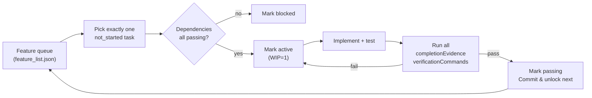

# 工作流与智能体执行规范

> **阅读时机**：执行任务、提交代码前。包含 ACID 原则、WIP=1 工作流、知识衰减防护和常见错误清单。

## WIP=1 工作流（核心规则）

> 规则来源：Lecture 07 — Draw Clear Task Boundaries for Agents

### 状态机

每个功能在 `feature_list.json` 中只能处于以下四种状态之一：

| 状态 | 含义 | 允许转入 | 允许转出 |
|------|------|----------|----------|
| `not_started` | 未开始，等待依赖满足 | — | `active`, `blocked` |
| `active` | 正在实现中 | `not_started` | `passing`, `blocked` |
| `blocked` | 因依赖或外部原因阻塞 | `not_started`, `active` | `active`（阻塞解除） |
| `passing` | 所有完成证据通过，功能完成 | `active` | — |

**全局 WIP 限制**：`active` 状态的功能数量 **必须 ≤ 1**。

### 工作循环



### 选取下一个任务的优先级

1. **阻塞检查**：检查所有 `blocked` 任务，如果依赖已 `passing`，将其标记为 `not_started`
2. **依赖就绪**：选择所有依赖都 `passing` 的 `not_started` 任务中优先级最高的
3. **高优先级优先**：`high` > `medium` > `low`
4. **无可用任务**：如果所有可执行任务都 `blocked`，更新 `PROGRESS.md` 记录阻塞原因，结束会话

### 完成证据（Completion Evidence）

每个功能的完成不是凭感觉，而是凭可执行的验证命令。

**完成标准**：
- `feature_list.json` 中该功能的所有 `completionEvidence` 条目必须全部通过
- 每个条目的 `verificationCommand` 必须以退出码 0 执行成功
- 如果 `verificationCommand` 为 `null`，则描述的行为必须通过人工验证

**验证示例**：

```bash
# 检查类型定义存在
grep -q 'export interface Lot' packages/core/src/models/lot.ts

# 运行单元测试
cd packages/core && npx vitest run src/models/lot.test.ts

# 运行完整检查
cd packages/core && pnpm lint && pnpm type-check && pnpm build
```

### VCR 监控

**Verified Completion Rate（验证完成率）** = `passing` / (`passing` + `active` + `blocked`)

- **目标 VCR = 1.0**（100%）
- **VCR < 1.0 时禁止激活新任务** —— 必须先让活跃任务达到 `passing`
- 每次会话结束必须在 `PROGRESS.md` 中记录当前 VCR

### Back-Pressure 监控

> Back-pressure = 未通过的功能数量 = Harness 对 agent 施加的压力。

```
backPressure = notStarted + active + blocked
total = len(features)
pressureRatio = backPressure / total
```

- **Zero back-pressure = 项目完成**
- `feature_list.json` 中 `scopeSurface.backPressure` 必须每次会话更新
- Agent 不得在 `backPressure.totalPending > 0` 时宣称「项目做完了」

### Feature List 是 Harness 的 Primitive

> 规则来源：Lecture 08 — Use Feature Lists to Constrain What the Agent Does

`feature_list.json` 不是备忘录，而是整个 Harness 的基础数据结构。四个组件都依赖它：

| 组件 | 从 feature list 读取什么 | 如果没有会怎样 |
|------|------------------------|--------------|
| **调度器** | 状态 → 选取 `not_started` | Agent 不知道下一步做什么 |
| **验证器** | `verificationCommand` → 判断完成 | Agent 凭感觉说「做完了」 |
| **交接报告** | 状态分布 → 生成 handoff 摘要 | 新会话花 20 分钟推断状态 |
| **进度追踪** | VCR + back-pressure → 健康指标 | 无法衡量项目真实进度 |

**单一真实来源原则**：
- 所有「需要做什么」的信息只来自 `feature_list.json`
- 代码中的 TODO 必须引用 feature ID：`// TODO(F004)`
- 禁止从对话历史、代码注释或 agent 记忆中推断需求

### Pass-State Gating（状态门控）

状态转换不是 agent 的自由意志，而是由验证结果控制：

```
not_started --[agent picks task]--> active --[run verificationCommand]--> ?
                                                                    |
                                                        all pass ---+--> passing
                                                        any fail ---+--> active (keep)
```

**Agent 权限矩阵**：

| 转换 | 触发条件 | Agent 权限 |
|------|----------|-----------|
| `not_started` → `active` | 依赖全部 `passing`，WIP ≤ 1 | ✅ 允许 |
| `active` → `passing` | **所有 `verificationCommand` 退出码 0** | ❌ **禁止直接操作** |
| `active` → `blocked` | 依赖变非 `passing` 或外部阻塞 | ❌ 禁止 |
| `blocked` → `active` | 阻塞解除 | ✅ 允许 |

**关键规则**：agent 必须先运行 `verificationCommand`，确认全部通过后，才能更新 `status` 为 `passing` 并记录 `evidence`。禁止凭感觉改状态。

---

## 初始化阶段 vs 功能实现阶段

**初始化**与**功能实现**是两种根本不同的工作，优化目标不同，不可混在同一阶段。

| 阶段 | 目标 | 产出 |
|------|------|------|
| **初始化** | 让后续所有会话都能高效工作 | 可运行环境、可验证测试、启动就绪清单、任务分解、Git checkpoint |
| **功能实现** | 交付验证过的业务功能 | 通过测试的代码、同步的文档、更新的进度 |

**初始化完成标准**（四项条件必须全部满足）：
- [ ] `make setup` 从零开始成功
- [ ] `make test` 至少有一个真实测试通过
- [ ] 新会话仅凭仓库内容就能回答「怎么运行」「怎么测试」「当前进度」「下一步做什么」
- [ ] 任务分解文件存在（`feature_list.json` + `PROGRESS.md`）
- [ ] 全部工作已提交到 git

> 当前项目初始化阶段 **已完成**。详细清单见 [`docs/startup-readiness.md`](../startup-readiness.md)。新会话直接开始功能实现。

---

## 添加新功能的步骤（WIP=1 + 四层验证模式）

> 规则来源：Lecture 07 + Lecture 08 + Lecture 09 + Lecture 10

1. **读取 `feature_list.json`** — 确认当前 `activeFeatureId` 和 `scopeSurface.vcr`
2. **检查 WIP 限制** — 如果有 `active` 任务，继续完成它；如果没有，选取下一个 `not_started` 任务
3. **检查依赖** — 确认该任务的所有 `dependencies` 都是 `passing`
4. **标记为 `active`** — 更新 `feature_list.json` 中的 `activeFeatureId` 和该任务状态
5. **生成本功能的 Sprint Contract** — 基于 `.harness/contracts/template.md`，定义范围、验证标准、排除项
6. **初始化 Task Trace** — `TRACE_FILE=$(bash scripts/harness-trace.sh init <featureId>)`
7. **在正确的包和目录中实现代码**
8. **同步更新文档** — 检查该包 `ARCHITECTURE.md`，如有接口/约束变更必须同步修改
9. **Layer 0 验证** — 运行 `scripts/verify-architecture.sh` 确认未违反架构边界
10. **Layer 1 验证** — 运行 `pnpm lint` 和 `pnpm type-check`
11. **Layer 2 验证** — 运行单元测试和构建（`pnpm test` + `pnpm build`）
12. **Layer 3 验证** — 运行端到端验证（`scripts/verify-layers.sh` 的 Layer 3：构建产物 + 跨组件符号检查）
13. **功能级验证** — 运行该功能的所有 `completionEvidence.verificationCommand`
14. **Evaluator Rubric 评分** — `bash scripts/evaluate-feature.sh <featureId>`，确认各维度评分
15. **全局验证** — 运行 `scripts/verify-layers.sh` 确保没有副作用
16. **标记为 `passing`** — 所有验证和评分通过后，更新 `feature_list.json`，记录 `evidence.passedAt` 和 `evidence.output`
17. **Finalize Task Trace** — `bash scripts/harness-trace.sh finalize`
18. **更新 `PROGRESS.md`** 和 VCR
19. **原子提交**：一次 commit 包含代码+测试+文档+trace 的完整变更

> **禁止行为**：
> - 不要「顺便」重构不相关的文件。发现 B 也需要改？记下来，等 A 完成后再说。
> - **Layer N 未通过时不得进入 Layer N+1** — lint 失败就不要跑测试，测试失败就不要跑端到端
> - **核心功能验证通过前禁止重构** — 先让功能通过所有测试，再考虑优化

---

## 端到端测试是真正的验证（Lecture 10）

> 规则来源：Lecture 10 — Only a Full Pipeline Run Counts as Real Verification

### 单元测试的系统性盲区

单元测试的设计哲学是**隔离**：mock 依赖，聚焦被测单元。这带来速度和精确性，但也制造了系统性盲区：

| 盲区类型 | 示例 | 单元测试 | 端到端 |
|----------|------|----------|--------|
| **接口不匹配** | core 传相对路径，web 期望绝对路径 | 通过（各自 mock） | **暴露** |
| **状态传播错误** | 仿真状态变更未正确反映到 UI store | 通过（独立状态） | **暴露** |
| **资源生命周期** | 3D 场景未在组件卸载时 dispose | 通过（独立资源） | **暴露** |
| **环境依赖** | 构建产物中缺少跨包符号 | 通过（本地源码） | **暴露** |

**结论**：跨组件变更（涉及 2 个以上包的修改）必须通过 Layer 3 端到端验证。

### 端到端验证改变编码行为

当 agent 知道工作将通过端到端测试验证时，编码行为会发生转变：

1. **主动考虑组件交互** — 写代码时会问「这个接口和上游怎么连？」而非孤立地优化单个函数
2. **尊重架构边界** — 知道 `scripts/verify-architecture.sh` 会检查，不会随意把 Vue 引入 core
3. **处理错误路径** — 端到端测试通常包含失败场景，迫使思考异常处理

### 验证层级定义

```
Layer 0: Architecture Boundaries  → verify-architecture.sh
         (core 不依赖 UI, 3d-engine 不依赖 Vue, workspace:* 协议)
Layer 1: Syntax & Static Analysis → lint + type-check
Layer 2: Runtime Behavior         → unit tests + build
Layer 3: System-Level Integration → build artifacts + cross-component symbols
```

**跨组件变更时，跳过 Layer 3 = 未完成。**

## 审查反馈提升（Review Feedback Promotion）

> 规则来源：Lecture 10 — 将反复出现的审查评论转化为自动化检查

每次发现 agent 的**新类别错误**时，按照以下流程将其永久化：

```
Code Review 发现反复出现的问题
        ↓
写成可执行检查脚本（或 ESLint 规则）
        ↓
错误消息必须包含 FIX 指令（告诉 agent 如何修改）
        ↓
加入 verify-architecture.sh 或 verify-layers.sh
        ↓
下次同类问题自动失败，Harness 自动变强
```

**示例**：发现 agent 在 `packages/core` 中引入了 Vue 类型导入。
- **旧方式**：审查评论「core 不能依赖 Vue」→ 下次可能再犯
- **新方式**：在 `verify-architecture.sh` 中添加 Rule 1
  ```
  ERROR: Found 'import from vue' in packages/core/src/
  WHY: @semi/core must be pure TypeScript. UI imports violate layer boundaries.
  FIX: Move Vue-related logic to apps/web or packages/ui. Core should only use plain TypeScript.
  ```

### Agent 面向的错误消息设计

所有自动化检查的**失败消息**必须包含三个元素：

1. **WHAT** — 发现了什么问题
2. **WHY** — 为什么这是问题（架构原则）
3. **FIX** — 具体怎么修改（可执行的步骤）

> **反例**：`"Direct filesystem access in renderer"`
> 
> **正例**：`"Direct filesystem access in renderer. All file operations must go through the preload bridge. Move this call to preload/file-ops.ts and invoke it via window.api."`

## 可观测性与结构化评估（Lecture 11）

> 规则来源：Lecture 11 — Making the Agent's Runtime Observable
>
> **可观测性是 Harness 的架构属性**，不是事后添加的功能。没有可观测性，agent 在不确定性中做决策，评估变成主观判断，重试变成盲目试探。

### Sprint Contract（冲刺合同）

每个功能在开始实现前，agent 必须基于 `.harness/contracts/template.md` 生成本功能的 Sprint Contract。

**Contract 的核心作用**：在编码前对齐预期，防止 generator 构建出 evaluator 因可预见原因拒绝的产出。

Sprint Contract 必须包含：

| 章节 | 说明 |
|------|------|
| **Scope** | 必须实现的事项 + **明确排除的事项**（防止范围蔓延） |
| **Verification Standards** | Layer 0-3 的通过标准 |
| **Acceptance Criteria** | A/B/C/D 四级评分标准 |
| **Risk & Assumptions** | 假设、风险、回退方案 |

**示例**：`.harness/contracts/template.md`

### Evaluator Rubric（评估量规）

将「好不好」从主观印象转化为基于证据的结构化评分。

**评分维度**（定义在 `.harness/rubrics/default.json`）：

| 维度 | 权重 | A（优秀） | D（不合格） |
|------|------|----------|------------|
| 代码正确性 | 30% | 所有测试通过，含边界情况 | 构建失败或主流程测试失败 |
| 架构合规性 | 25% | verify-architecture.sh 通过 | 违反核心架构边界（一票否决） |
| 测试覆盖 | 20% | 主流程 + 边界 + 错误路径 | 无新增测试 |
| 文档同步 | 15% | 所有相关文档已更新 | 未更新任何文档 |
| 端到端验证 | 10% | Layer 3 完全通过 | Layer 3 关键检查失败 |

**使用方式**：
```bash
bash scripts/evaluate-feature.sh F004
```

输出示例：
```
Scorecard:
----------
代码正确性                A [████] 1.20/1.20 — 所有 verificationCommand 通过
架构合规性                A [████] 1.00/1.00 — 功能已达到 passing 状态
测试覆盖                 B [███░] 0.60/0.80 — 测试存在且通过
文档同步                 A [████] 0.60/0.60 — 文档验证项存在
端到端验证                A [████] 0.40/0.40 — 端到端验证通过

Overall: A (优秀) — 3.80/4.00
```

### Task Trace（任务追踪）

每次会话的完整决策路径记录，是可观测性的核心基础设施。

**Trace 记录内容**：
- 会话生命周期（开始、事件、结束）
- 各验证层的结果和耗时
- 功能级 verificationCommand 的执行结果
- 错误和决策上下文

**使用方式**：
```bash
# verify-layers.sh 会自动创建 trace（当传入 feature-id 时）
bash scripts/verify-layers.sh F004

# 手动创建和记录
trace_file=$(bash scripts/harness-trace.sh init F004)
export TRACE_FILE=$trace_file
bash scripts/harness-trace.sh record "code_change" '{"files": ["a.ts"]}'
bash scripts/harness-trace.sh layer 0 "passed"
bash scripts/harness-trace.sh finalize
```

**Trace 文件位置**：`.harness/traces/trace-<featureId>-<timestamp>.json`

### 为什么 agent 自己不能解决可观测性

1. **Agent 不知道自己不知道什么** — 不会主动记录它没意识到的信号
2. **日志格式不一致** — 不同会话使用不同格式，无法系统分析
3. **过程可观测性无法通过日志解决** — Sprint Contract 和 Rubric 是需要 harness 支持的结构化产物

## 遇到问题的处理

- 如果架构约束阻止你实现功能，**不要绕过约束**
- 先修改架构文档（`AGENTS.md` 或 `DECISIONS.md`），再调整代码
- 如果必须引入新依赖，在 `AGENTS.md` 中记录理由
- 如果修改了工具链配置（ESLint、TypeScript、构建脚本），必须更新 `docs/toolchain.md`
- **初始化阶段已完成**：新会话不应再修改基础设施配置，直接开始功能实现

---

## 跨会话连续性

上下文窗口是有限的。长任务必然跨会话，而会话边界会导致「理解漂移」——新会话没有上一轮的推理过程记忆，可能重复已做的工作，或推翻上一轮经过深思熟虑的决策。

### 核心概念

| 概念 | 说明 |
|------|------|
| **上下文焦虑** | 当上下文接近窗口限制时，agent 倾向于仓促完成任务、跳过验证。Anthropic 观察到这是普遍现象 |
| **重建成本** | 新会话达到可执行状态所需的时间。好的 harness 应压缩到 3 分钟以内 |
| **漂移** | 每轮会话边界引入的 agent 理解与代码库实际状态的差距。无控制时会逐轮累积 |
| **混合策略** | 短任务（<30 分钟）单会话完成；长任务跨会话时必须使用持久化文件交接 |

### 状态持久化文件

仓库中的以下文件共同构成「交接 artifacts」：

- **`feature_list.json`** — 范围表面：任务状态、依赖关系、完成证据、VCR
- **`PROGRESS.md`** — 当前进度、验证状态、阻塞项、下一步行动
- **`DECISIONS.md`** — 关键设计决策及原因（保留「为什么」，不只是「做了什么」）
- **Git commits** — 原子提交形成自动版本快照，commit message 应说明「做了什么 + 为什么」
- **验证记录** — `make check` 的结果是状态的一部分，必须在 `PROGRESS.md` 中记录
- **Task Trace** — `.harness/traces/trace-<featureId>-<timestamp>.json`：会话的完整决策路径记录，包含每层验证结果、耗时、错误。新会话通过阅读 trace 可在 3 分钟内重建状态

### Clock In / Clock Out 检查清单

**Clock In（会话开始）**：
- [ ] 读取 `PROGRESS.md`、`DECISIONS.md`、`feature_list.json`
- [ ] **读取最新的 Task Trace**（`.harness/traces/trace-<featureId>-*.json`）— 重建上一轮决策上下文
- [ ] 确认当前 `activeFeatureId` 和完成证据
- [ ] 运行 `make check` 确认仓库自洽
- [ ] 从 `active` 任务继续执行，或按 WIP=1 规则选取下一个任务

**Clock Out（会话结束）**：
- [ ] 更新 `feature_list.json`（任务状态、已完成证据、activeFeatureId）
- [ ] 更新 `PROGRESS.md`（进度、测试状态、已知问题、阻塞项、VCR）
- [ ] 如有新决策，追加到 `DECISIONS.md`
- [ ] **确保 Task Trace 已 finalize**（运行 `scripts/harness-trace.sh finalize`）
- [ ] 运行 `make check` 确认自洽状态
- [ ] 原子提交所有已完成工作（包含代码 + 测试 + 文档 + trace）

> **判定标准**：如果任务预计消耗超过 60% 的上下文窗口，立即开始准备 handoff（更新 PROGRESS.md、做原子提交）。不要等上下文耗尽才匆忙收尾。

---

## ACID 状态管理（智能体工作原则）

将数据库事务原则映射到 agent 的任务执行：

| 原则 | 含义 | 执行标准 |
|------|------|----------|
| **A**tomic（原子性） | 每次提交是完整的逻辑单元 | 一个功能 = 一次 commit。不要半成品。代码+测试+文档同步更新。 |
| **C**onsistent（一致性） | 提交后仓库处于自洽状态 | 提交前必须 `make check` 全部通过。 |
| **I**solated（隔离性） | 并行任务不互相污染 | WIP=1，同时只处理一个功能。不要混排无关修改。 |
| **D**urable（持久性） | 关键知识必须持久化到仓库 | 架构决策、约束变更必须写入 `AGENTS.md` 或 `DECISIONS.md`。口头交接的知识在会话结束时就丢失了。 |

---

## 知识衰减防护

**过时的文档比没有文档更危险。**

### 文档-代码绑定规则

1. **修改代码时必须检查对应模块的 `ARCHITECTURE.md`** —— 如果接口、职责或约束发生变化，文档必须同步更新
2. **修改 `AGENTS.md` 或专题文档中提到的任何配置或流程时，必须同步更新对应文档**
3. **新增、删除或重命名包时，必须更新根目录仓库结构图和各包间的依赖图**
4. **修改功能实现时，必须同步更新 `feature_list.json` 中对应功能的完成证据状态**

### 衰减检查清单（每次提交前）

- [ ] 我修改的代码旁边的 `ARCHITECTURE.md` 是否仍然准确？
- [ ] 我是否引入了新的工具链依赖？如果是，`docs/toolchain.md` 和 `AGENTS.md` 是否已更新？
- [ ] 我是否修改了构建脚本？如果是，`Makefile` 和 `docs/toolchain.md` 是否已同步？
- [ ] 我是否做出了需要长期记住的架构决策？如果是，是否写入了 `DECISIONS.md`？
- [ ] 我是否更新了 `feature_list.json` 中的任务状态和完成证据？
- [ ] 我是否更新了 `PROGRESS.md` 中的 VCR 和下一步？

---

## 常见错误预防清单

修改代码前，对照此清单自查：

| # | 检查项 | 验证方式 |
|---|--------|----------|
| 1 | 新增包是否有 `eslint.config.js`？ | 运行 `pnpm lint` |
| 2 | lint 脚本是否使用了 `--ext`？ | 必须是 `"eslint src"` |
| 3 | 包内 `package.json` 是否设置了 `"type": "module"`？ | 检查文件 |
| 4 | 是否引入了 `@typescript-eslint/*` 旧包？ | 必须是 `typescript-eslint` |
| 5 | `@semi/ui` 组件修改后是否同步更新 `index.d.ts`？ | 检查类型导出 |
| 6 | `tsconfig.json` 中的 `paths` 是否指向 `dist/` 或 `index.d.ts`？ | 不是 `src/` |
| 7 | vitest 脚本是否有 `--passWithNoTests`？ | 检查 `package.json` |
| 8 | 浏览器 API 是否在 ESLint globals 中声明？ | 检查 `eslint.config.shared.js` |
| 9 | 修改代码后是否同步更新了对应模块的 `ARCHITECTURE.md`？ | 检查该包文档 |
| 10 | 是否做出了新的架构决策？是否写入了 `DECISIONS.md`？ | 检查 `DECISIONS.md` |
| 11 | 当前是否有超过 1 个 `active` 功能？ | 检查 `feature_list.json` |
| 12 | 新功能的完成证据是否包含可执行的 verificationCommand？ | 检查 `feature_list.json` |
